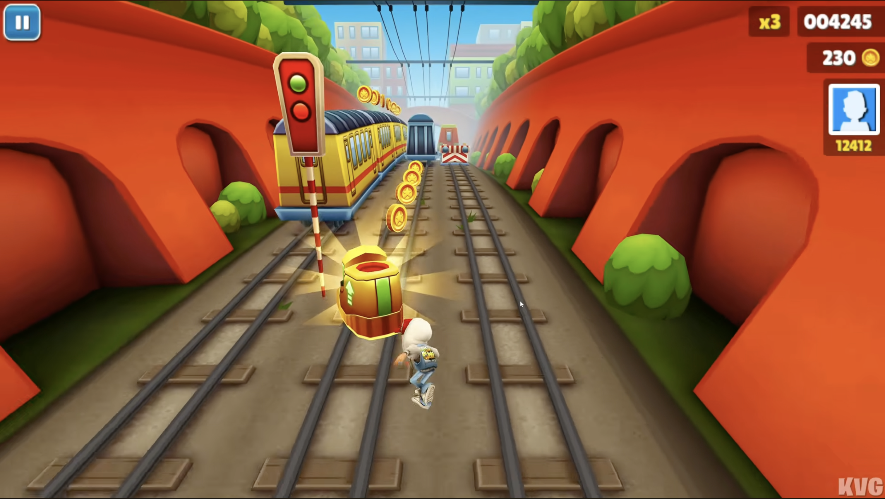
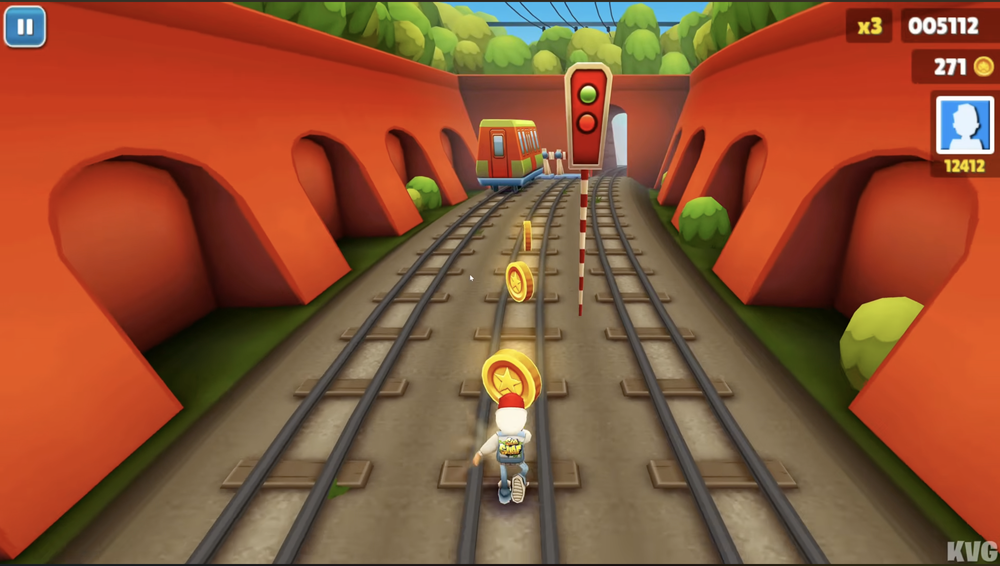
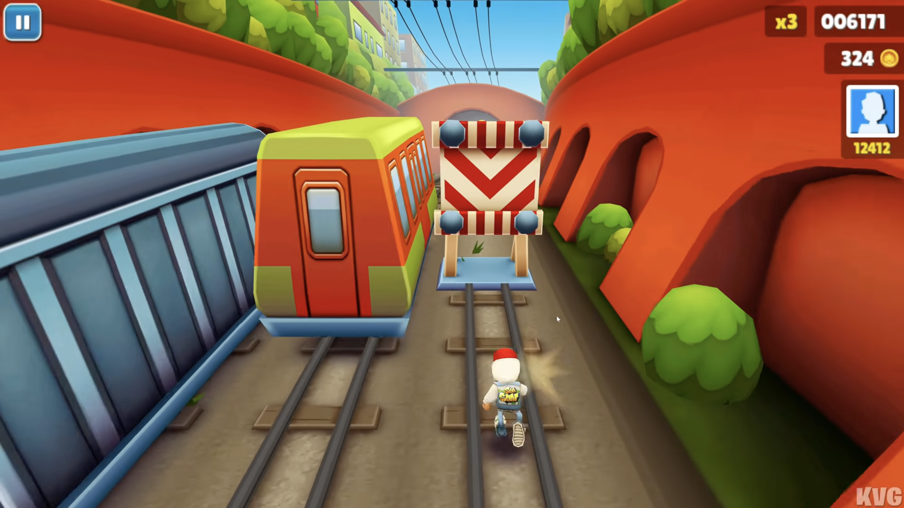

# Especificação da Implementação

## Integrantes da dupla

- **Aluno 1 - Nome**: `Gabriel Prestes Perini`
- **Aluno 1 - Cartão UFRGS**: `00334582`

- **Aluno 2 - Nome**: `Bruno Machado Haberkamp`
- **Aluno 2 - Cartão UFRGS**: `00314594`

## Detalhes do que será implementado

- **Título do trabalho**: `Rail Rush`
- **Parágrafo curto descrevendo o que será implementado**: `Jogo 3D de corrida infinita que soma pontos pela distância e coleta de moedas, com obstáculos e power-ups. O personagem principal corre automaticamente e o jogador pode trocar entre 3 faixas, rolar e pular para evitar obstáculos e coletar moedas. Vai ter os power ups classicos do jogo e mais um extra de distribuiçao de moedas em curva Bézier cúbica. A velocidade aumenta com o tempo e é game over quando ele colide com um obstáculo.`

## Especificação visual

### Vídeo - Link

[https://www.youtube.com/watch?v=bdmG3oh-ZD8](https://www.youtube.com/watch?v=bdmG3oh-ZD8)

### Vídeo - Timestamp

- **Timestamp inicial**: `1:30`
- **Timestamp final**: `2:00`

### Imagens

#### Imagem 1

- **Descrição**: `Personagem principal alternando de linha para colidir com o power-up e coletando-o.`

#### Imagem 2

- **Descrição**: `Personagem principal coletando moedas no jogo através de colisões.`

#### Imagem 3

- **Descrição**: `Personagem principal se movendo para nao colidir com os obstáculos (trens, placas, túneis, etc.).`

## Especificação textual

### Malhas poligonais complexas
`São os .obj, dentre eles o personagem principal, os obstáculos (trens, placas, túneis, etc.), ambientes e os power-ups. Todos eles são malhas poligonais complexas que serão carregadas e renderizadas na cena.`

### Transformações geométricas controladas pelo usuário
`Setas laterais trocam a faixa do personagem (movimento lateral), seta pra cima faz pular e pra baixo rolar.`

### Diferentes tipos de câmeras
`A camera principal é look-at em 3ª pessoa, mas há também uma câmera livre com o jogo pausado que é ativada quando clica C. A camera principal tem posicionamento olhando para frente do personagem principal. A camera livre tem o jogo pausado e pode olhar ao redor do cenario se deslocando pela cena.`

### Instâncias de objetos
`São as moedas, trens, placas, barreiras, túneis, power-ups.`

### Testes de intersecção
`Todos estarão em collisions.cpp, personagens e obstaculos que viram game over, personagem e moedas pra coleta, personagem e power-ups pra coleta, rampas para subirem em trens.`

### Modelos de Iluminação em todos os objetos
`Blinn-Phong (difuso + especular + ambiente), com uma luz direcional fazendo o papel de sol. Interpolação de Phong (por fragmento) na maioria dos objetos e Gouraud (por vértice) em moedas, para mostrar os dois modelos.`

### Mapeamento de texturas em todos os objetos
`Chão com trilhos, paredes com texturas de pedra, prédios do ambiente com texturas de tijolos, moedas com textura de ouro, personagem, trens, placas, túneis e power-ups com suas próprias texturas custumizadas.`

### Movimentação com curva Bézier cúbica
`Vai ter um power-up em formato de cofrinho de porco que ao ser coletado, faz um porquinho com asas voar em uma curva Bézier cúbica no céu, e distribuindo moedas pelo caminho deixando um rastro de moedas`

### Animações baseadas no tempo ($\Delta t$)
`velocidade do personagem principal, velocidade dos obstáculos, velocidade dos trens em movimento, velocidade da camera principal, troca de faixa, pulo, rolamento e o fator t da curva Bézier cúbica do power-up de distribuição de moedas.`

### Funcionalidade extra obrigatória

`Ao coletar moedas e power ups irá ter um sistema de particulas na colisão para demonstrar a coleta. Também terá um GUI com menu, pausa e gameover.`

## Limitações esperadas

`Animaçoes do personagem, como braços e cabeça. Inspetor e cachorro não será implementado. O visual será mais simples e não tão cartoon como no jogo original, sombra no chão do personagem não será implementada, HUD completo com avatar e recorde não será implementado. Pista curva também não será implementada, apenas pista reta.`
